# Re-Classifying Vogue Collection Coverage
##
## Goal
To reclassify Vogue runway show coverage from the Vogue website.
- What other categories can be created?  
- How is the text for each collection related?
- Articles currently only categorized by season, year, and designer
##
## The Data
- Gathered 3525 articles covering major collections from 2018 to 2020 from the Vogue website. 
- Used Selenium to scrape from the Vogue website

# First Look at the Corpus
- Created a Bag of Words to explore most prevelant words (stopwords removed)
- Then visualized them with a word cloud to further explore
##
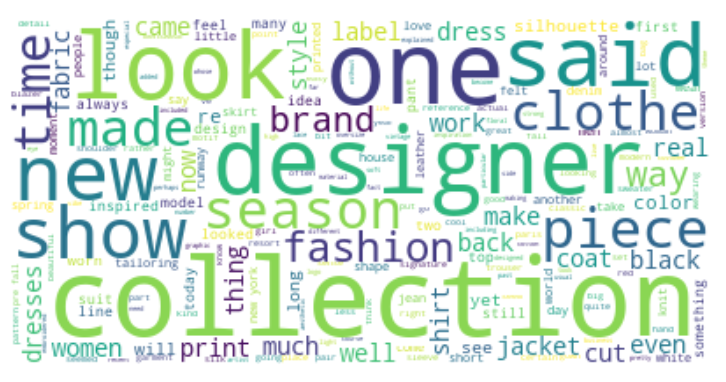

## Further Cleaning and Natural Language Processing
- Created a list of 100 most common words in corpus (after removal of stop words).
- Used domain knowledge to pick terms (very general)  to remove from corpus that would not help in modeling more specific topics (collection type, designer, year, and common terms like ‘runway’, ‘designer’, ‘collection’ (after
- Removed numbers and tokens with a length less than 3 (were words that cluttered the corpus or designer names.)
- Lemmatized the updated corpus
- Created bi-gram and tri-gram models with a minimum count of 10 and converted them into tokens
- Filtered extremes since I'm trying to find more specific niche words tokens must appear 10 times and appear in no more than 10% of the documents. (decided through trial and errorr)

## First Model
- Created an LDA model to extract topic from the textual data.
- First chosen topic count = 5 (a random number just to see observe initial results)
- Coherence score was .374

# Improving the model
- To improve model created a line graph showing how coherence scores increase by topic
-  The first peak occured at 8 (not too few but not too many topics so they can be specific but not as overlapping)
###
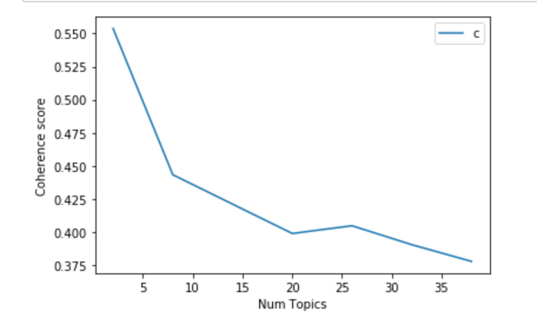
###
- The coherence scorre with 8 topics was 0.439 
- There wasn't much overlap of topics either (which I was worried about due to the lower number of topics)

## Final Model Relationships (using Spacy)
###
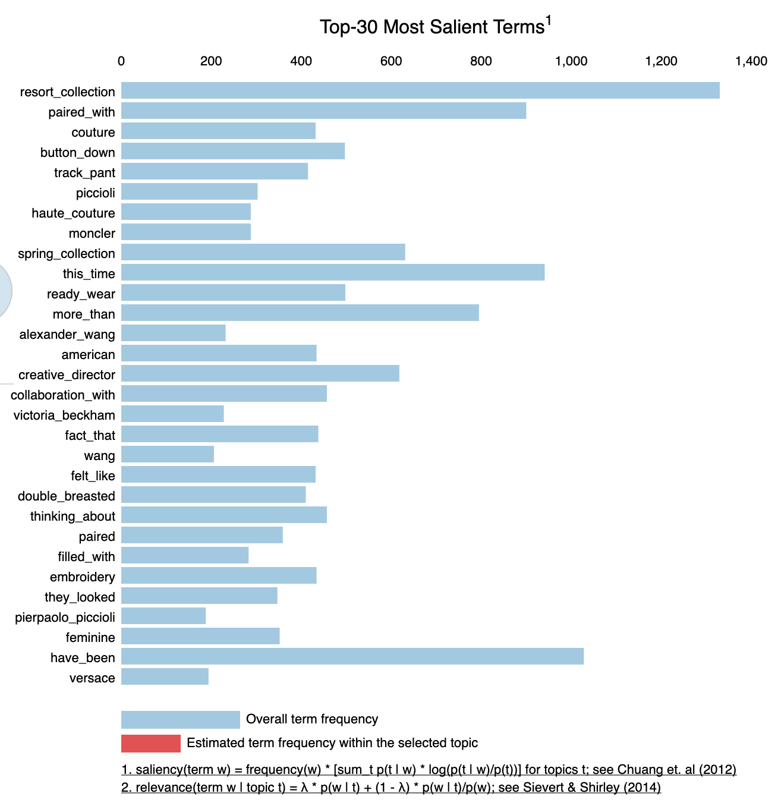
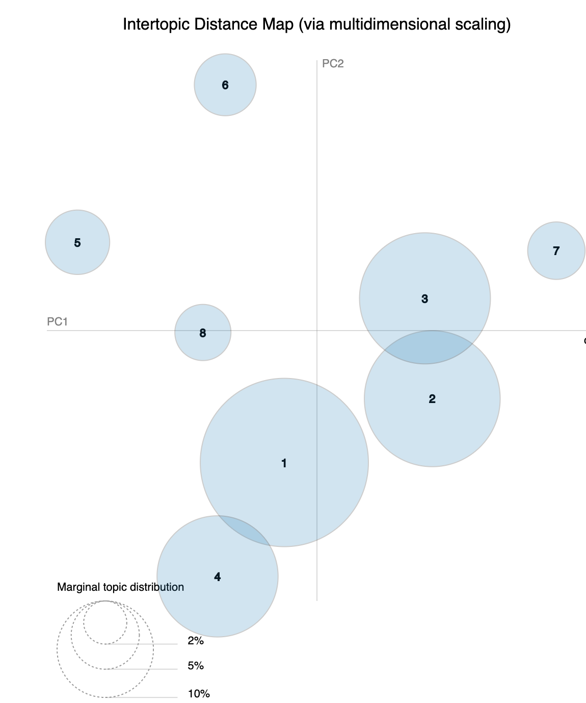
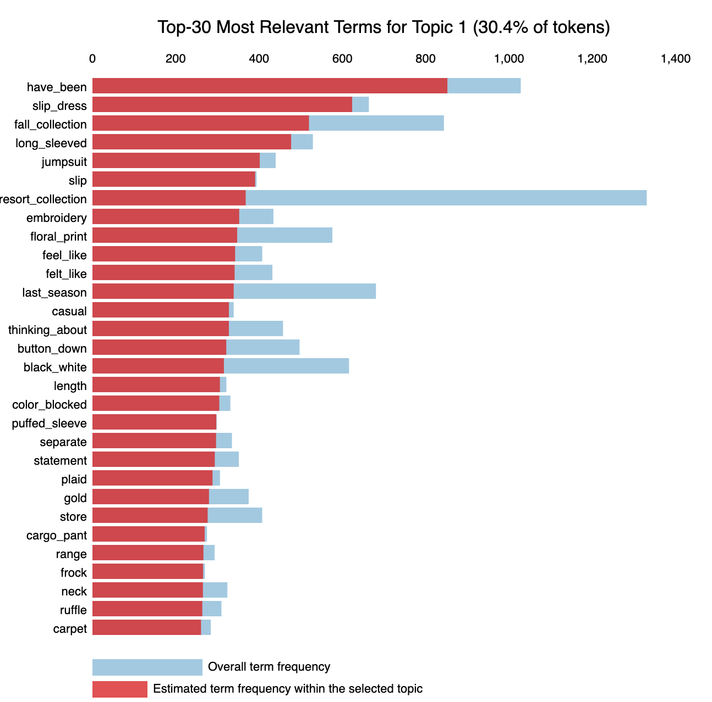
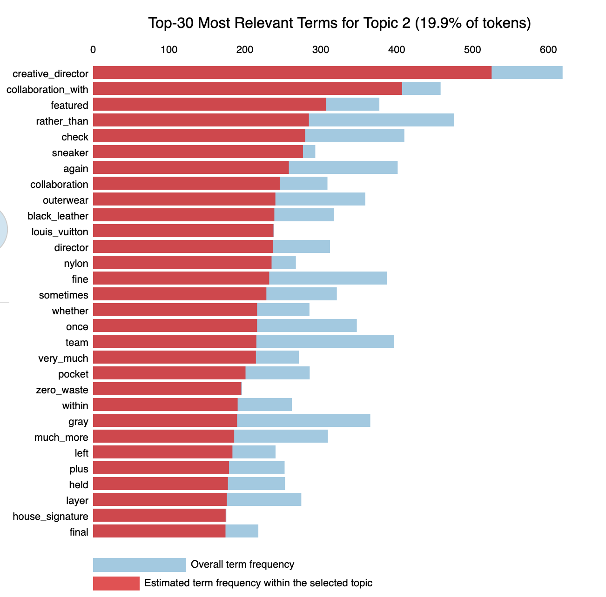
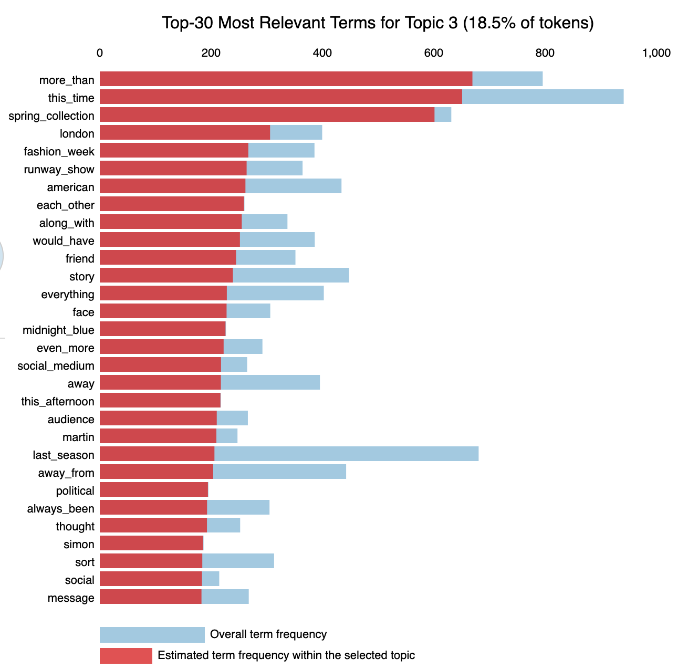
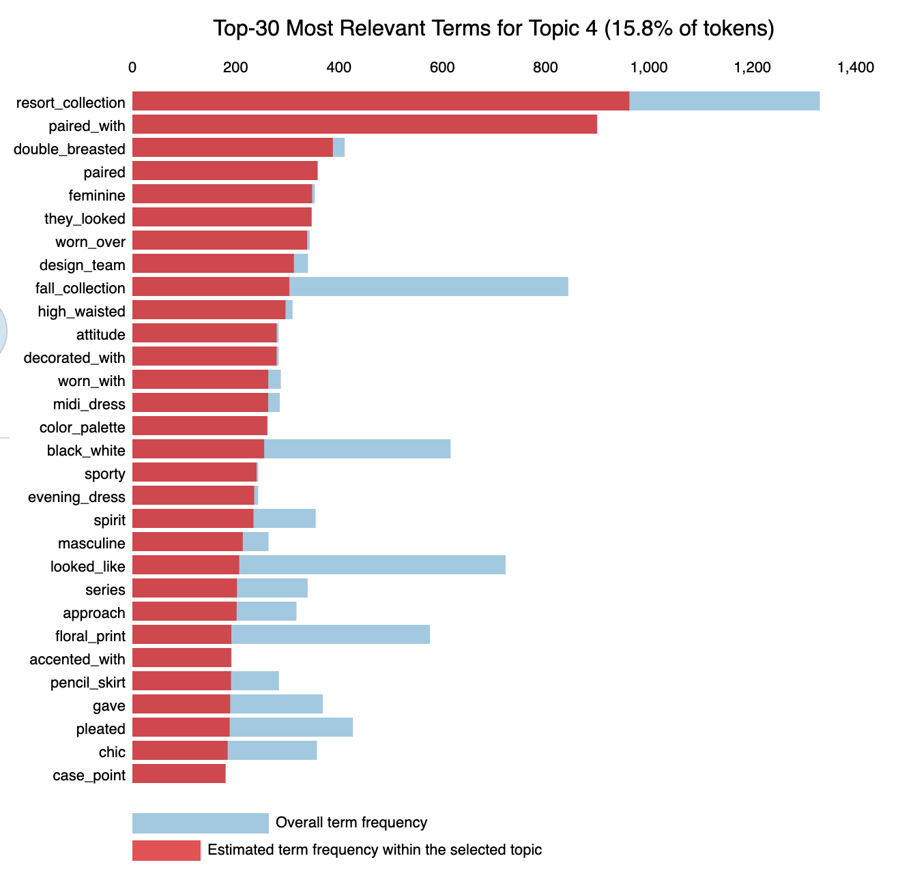
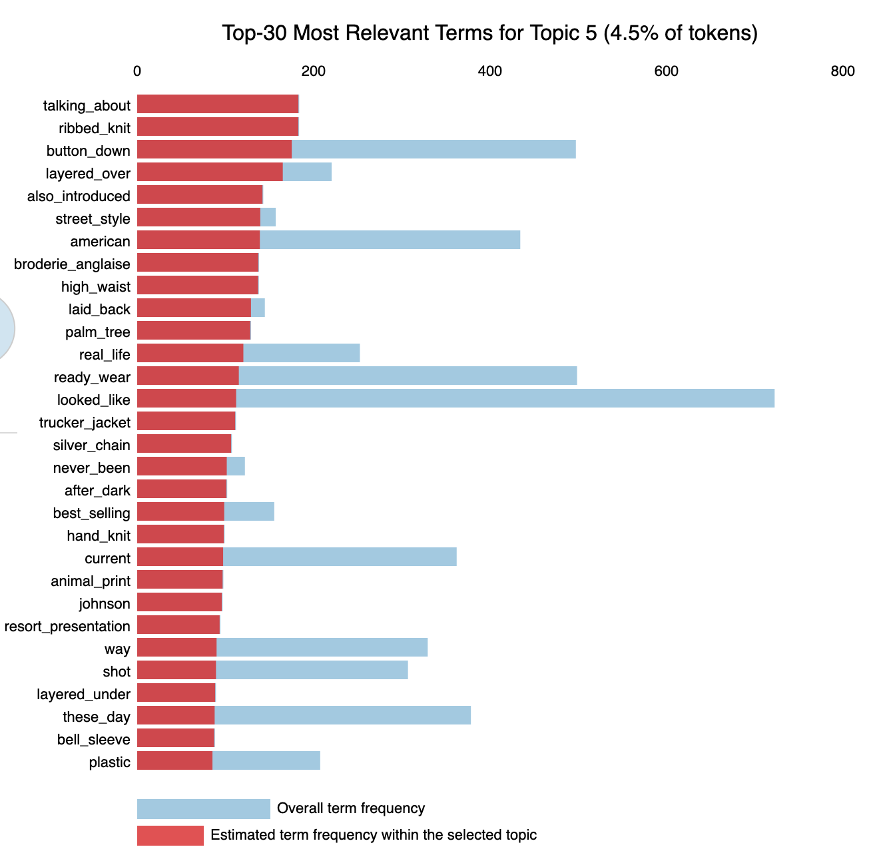
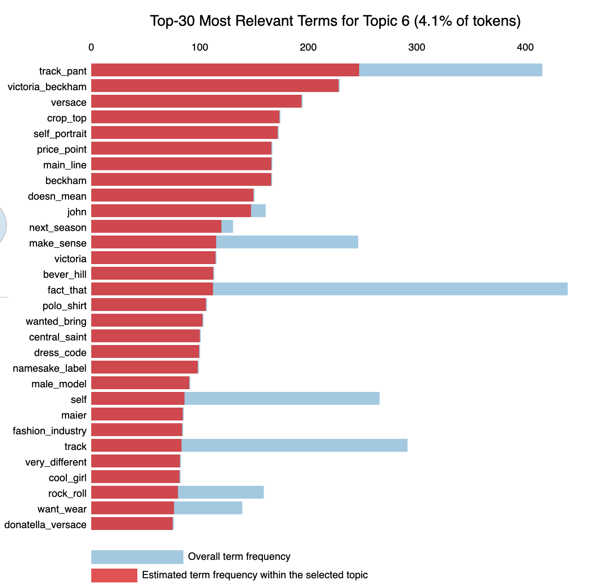
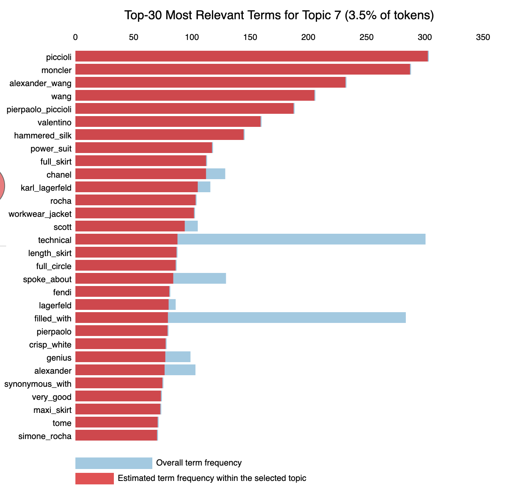
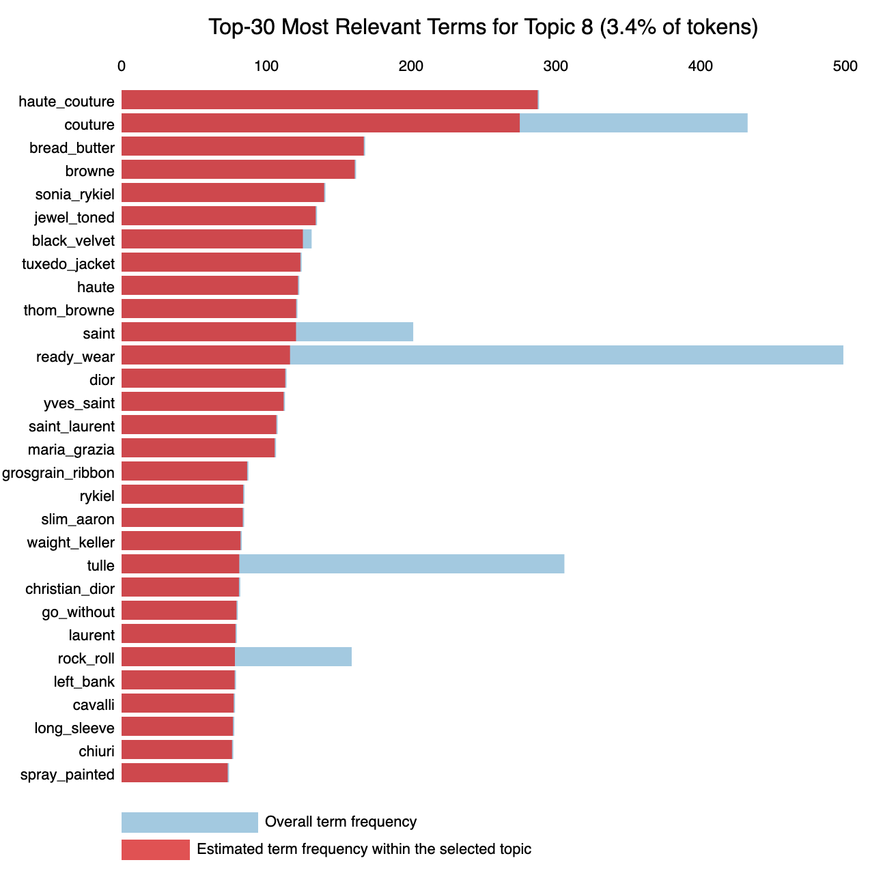
## Future Work:
- Continue to update as new seasons come
- Analyze text more for additional stop words to eliminate more designer names and common words not relevant to goals of this topic modeling
- Collect even more data
- Figure out ways to further improve coherence score.
- Create bar plot visual for topic distribution
- Test these topics on other vogue runway text
